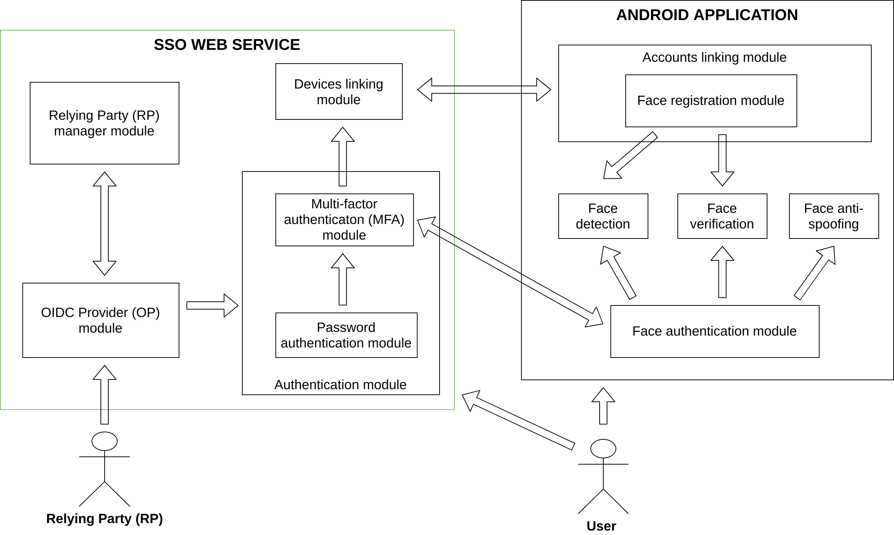
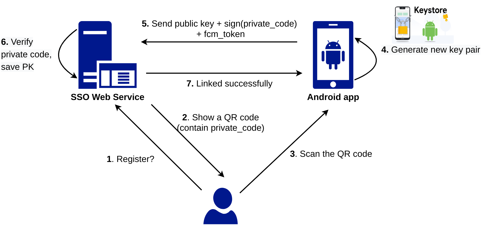
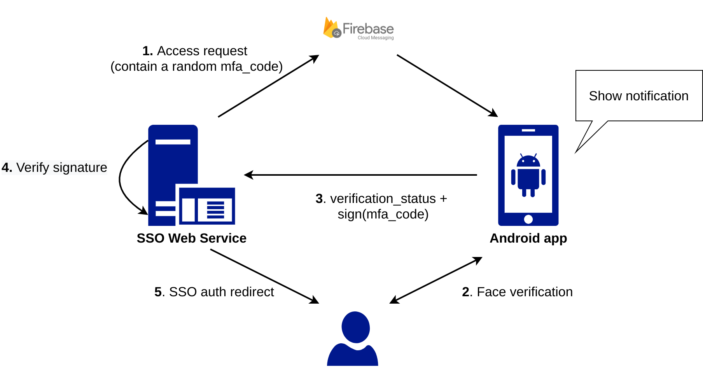

<a href="https://authlib.org/">

</a>

# Flask Open ID Connect (OIDC) Provider combined with Facial Two-Factors Authentication (2FA)

<a href="./LICENSE"></a>

[oidc_provider_with_facial_mfa]: https://github.com/dangnh0611/oidc_provider_with_facial_mfa
[facial_verification_android]: https://github.com/dangnh0611/facial_verification_android
[MobileFaceNet_TF]: https://github.com/dangnh0611/MobileFaceNet_TF

## Table of contents

  - [About the project](#about-the-project)
    - [What is the purposes of the whole project ?](#what-is-the-purposes-of-the-whole-project-)
    - [How it work ?](#how-it-work-)
      - [Linking new token device](#linking-new-token-device)
      - [2FA face verification](#2fa-face-verification-flow)
  - [About this repository](#about-this-repository)
    - [Technologies](#technologies)
    - [Features](#features)
  - [How to run](#how-to-run)
  - [Inspirations](#inspiration)


## About the project
This repository is a part of the project: **Single Sign On (SSO) Provider combined with Facial Two-Factors Authentication (2FA)**.

It contains 3 repositories:
- [oidc_provider_with_facial_mfa][oidc_provider_with_facial_mfa]: SSO Provider Web service
- [facial_verification_android][facial_verification_android]: An Android application to support 2FA with facial verification feature.  
- [MobileFaceNet_TF][MobileFaceNet_TF]: MobileFaceNet deep face recognition model
---
### What is the purposes of the whole project ?
- Build a **Single Sign On (SSO) Provider** web service that implement the [OpenID Connect (OIDC)](https://openid.net/connect/) specification with [Authlib](https://authlib.org/). This SSO Provider allows Relying Parties (RPs) to register their applications and integrate this SSO service (e.g a `Login with DOneLogin` button).
- Integrate the **Two-Factor Authentication (2FA)** mechanism for better security. This project uses facial recognition as the 2nd factor that user can enable.
- Develop an Android application for 2FA facial registration/verification with frontal camera, treats user's smart phone as a token device, interacts with SSO web service to authenticate user.
- System/protocol design & implementation must ensure high security, can prevent many known attacks. I propose an ad-hoc protocol for secure messages exchange, inspired by the [WebAuthn standard](https://webauthn.guide/).
- Typical Authentication Service: email confirmation, reset password, etc.
---
### How it work ?


>An user who want to enable 2FA must link at least one token device (Android smart phone) with SSO web service first. After that, he/she can use that device to authenticate using facial recognition feature.
#### Linking new token device

Flow:  
1. User choose option to link a new token device on SSO web app.
2. Web app shows a QR code which contains a random 48-characters token called `private_code`. This `private_code` must be kept private until the linking process is completed.
3. User open the [DOneLogin Android app][facial_verification_android] and use it to scan that QR code.
4. Android app generates a new Asymmetric Cryptography key pair, protected by [Android Keystore](https://developer.android.com/training/articles/keystore) system.
5. Android app sends the generated `public key`, `fcm_token` and signature on `private_code` extracted from the scanned QR to the SSO Web service.
6. SSO Web service verifies the signature and `private_code`. If it matches, save user's `public key`, `fcm_token`,.. to database. The linking process is completed successfully and the Android app also saves the key information (key alias,..) for future uses.

#### 2FA face verification


Flow:  
1. When the SSO Web service need to verify user's identity for 2FA, such that after an user had entered his/her correct password and be redirected. SSO Web service generates a new random 48-characters token called `mfa_code`. This code is sent to user's Android phone via Firebase Cloud Messaging (FCM) since the SSO service has already known the device's FCM token.
2. User clicks on notification, or opens the app to verify his/her face using smart phone's frontal camera.
3. If it matches (face matching + anti-spoofing), Android app send `verification_status` (such as True/False) and a signature on `mfa_code` to the SSO Web service. The signing process is supported and secured by Android Keystore, using the previously registered private key.
4. The SSO Web service verifies the signature using the corresponding saved public key of user's token device. If it matches, redirection is done based on the `verification_status` (e.g Valid or Invalid).

---

## About this repository
This repository is the SSO Web service implementation, a part of the whole project.

### Technologies
- **Backend**: Python 3, Flask, Authlib, firebase-admin, Google reCAPTCHA v2, Flask-Login, Flask-Session, Flask-SQLAlchemy, Flask-WTF, pycryptodome, PyQRCode, OpenSSL.
- **Frontend**: HTML5, CSS3, Bootstrap 3, SB Admin 2, JS, Handlebars JS.

### Features
- [x] Basic authentication services: Signup, Signin
- [x] Account confirmation by email
- [x] Reset password by email
- [x] Google reCAPTCHA v2 to prevent brute force attack
- [x] Two-factor authentication (2FA)
- [x] Link/manage token devices
- [x] Allow Relying Parties (RPs) to register/manage their applications
- [x] OIDC Discovery Endpoint
- [x] Example of RP application

---

## How to run
1. Config the app, generate self-signed SSL certification and RS256 key pair. Take a look at [setup.sh](./setup.sh) for more details. 
```bash
sudo chmod +x setup.sh
./setup.sh
```

2. Get your own [Google reCAPTCHA v2](https://www.google.com/recaptcha/about/) key pair. Fill the generated `./instance/config.py` with your own config: app secret key, gmail credentials, reCAPTCHA key pair.

3. Get your own [Firebase Cloud Messaging (FCM)](https://firebase.google.com/docs/cloud-messaging) credentials in JSON format, put it at `./instance`, such as `./instance/donelogin-9f53f-firebase-adminsdk-sxu56-8682d3b594.json`
4. Activate virtual environment then install dependencies:
```bash
python3 -m venv env
source venv/bin/activate
pip3 install -r requirements.txt
```
5. Start OIDC Provider on port 5000:
```bash
./run_op.sh
```
6. Optionally, to start Relying Party demo application, e.g on port 3000:
```bash
./run_rp.sh 3000
```
>**Note**: to make it work, you'll need to register a new application first, get the `client_id` and `client_secret`, then fill out some config variables on [relying_party/config.py](./relying_party/config.py))

---

## Inspirations
This project is inspired by the following repositories:
- [authlib/example-oidc-server](https://github.com/authlib/example-oidc-server)
- [authlib/demo-oauth-client](https://github.com/authlib/demo-oauth-client)
- [StartBootstrap/startbootstrap-sb-admin-2](https://github.com/StartBootstrap/startbootstrap-sb-admin-2)
- [toddbirchard/flasklogin-tutorial](https://github.com/toddbirchard/flasklogin-tutorial)